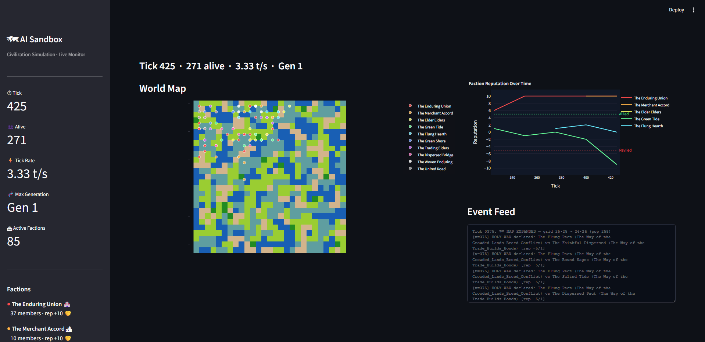

# Emergent AI Civilization Simulator
[](https://badge.fury.io/py/thalren-vale-simulation)
[](LICENSE)
[](https://www.python.org/downloads/)
[](https://doi.org/10.5281/zenodo.18889942)

> **Watch factions form, trade, war, betray, and mythologize —
> all from simple survival rules. No scripted behavior. Pure emergence.**

---

## What Is This?

*Figure 1: The Streamlit dashboard visualizing a 1,000-tick run on an Intel N95.*

Thirty nameless inhabitants are dropped onto a Perlin-noise-generated world. They eat, migrate, and slowly build trust with their neighbors. From that trust come shared beliefs. From those beliefs come factions. From faction rivalry comes trade — and war. Tech trees create asymmetric advantages. Diplomacy builds fragile alliances. Inhabitants form families, bear children, and pass their beliefs to the next generation. When enough time passes, the old world shatters and a new era dawns.

None of it is scripted. Every war, betrayal, and alliance you see is unique — because the civilization that produced it was unique.

An optional LLM mythology layer can write chronicles, myths, and epitaphs using a local model via Ollama — but the simulation runs fully standalone. A live Streamlit dashboard shows the world map, faction borders, and reputation graph updating in real time.

Fully playable on a **$150 Intel N95 mini-PC with 16 GB RAM**. No GPU required.

---

## Research Paper

This engine is the subject of an academic paper available as a preprint:

> **Thalren Vale: Civilizational-Scale Social Emergence from Survival-Scale Agent Heuristics**
> Brandon Simms (2026). *Preprint forthcoming on Preprints.org.*

The paper characterises 100 independent simulation runs, identifies three emergent mechanisms at distinct evidential tiers (cyclical population dynamics — confirmed; deliberative bypass — latent; reverse assimilation — falsified), and presents a composable ablation study isolating the causal contribution of individual layers.

The full 100-run log archive (~12 GB, ~130 million lines) is archived on Zenodo: [doi.org/10.5281/zenodo.18828593](https://doi.org/10.5281/zenodo.18828593)

---

| Stat | Value |
|------|-------|
| Starting inhabitants | 30 |
| Population cap | 1,000 (configurable) |
| Simulation layers | 9 (0–8) |
| Ticks per run | 10,000 (configurable) |
| Terrain generation | Perlin noise (height + moisture + depth) |
| Biomes | 6 — forest, plains, mountains, desert, coast, sea |
| LLM mythology | Optional — disabled by default |
| External API calls | Zero |
| Scripted events | Zero |
| Python dependencies | `noise`, `streamlit`, `plotly`, `numpy`, `streamlit-autorefresh` |

---

## Features

### World & Terrain

- 🌍 **Three-field Perlin terrain** — Height, moisture, and depth noise fields produce coherent biome layouts across a dynamically-scaled grid. Sea coverage is calibrated to 25% of the map via depth-noise percentile thresholding — guaranteed regardless of random seed.

- 🗺 **Six distinct biomes** — each with unique movement costs, resource caps, and survival characteristics:

  | Biome | Move Cost | Notes |
  |-------|-----------|-------|
  | Plains | 5 (baseline) | Default food + ore |
  | Coast | 5 | Port bias for settlements; fishing when Sailing researched |
  | Forest | 10 (0.5× speed) | 2× food density (cap 28); dense but slow |
  | Desert | 7 | Surface scrap ore (cap 30); sparse food |
  | Mountains | 9 | High stone; rough terrain |
  | Sea | 8 | Impassable without Sailing tech; 2× travel speed for sailors |

- 🌊 **Navigable seas** — Sea tiles block movement until a faction researches Sailing (Industrial tier 2). Sailors traverse sea at 2× effective range. Coastal factions with Sailing earn passive fishing income (+1 food per member every 3 ticks on coast tiles). Settlements prefer coastlines (port bias).

- 🧭 **Cost-adjusted pathfinding** — Inhabitants score neighbors by `food × (5 / move_cost)`: plains win over desert treks, forests are lucrative but slow, sailors exploit sea lanes. No A* needed — emergence from local greedy choice.

- 📦 **Biome integer IDs** — Each tile stores a compact `biome_id` int for fast O(1) comparisons in hot loops. Sea tiles are skipped entirely during resource regeneration (~25% of tick work eliminated on N95 hardware).

- 🌱 **Population-scaled food** — Resource regeneration scales with population pressure (`1.0 + 0.5 × pop/cap`). An extinction guard doubles food output when population drops below 10% of the cap.

- ❄ **Seasons** — A 50-tick cycle with an 8-tick winter window. Winter halts food regeneration (reduced to 0.125×); spring restores it (0.25×). Five resource types: food, wood, ore, stone, water.

- 🏙 **Dynamic map scaling** — The grid starts at 8×8 and expands every 25 ticks as population grows, generating new biome tiles while preserving existing terrain.

### Settlements

- 🏰 **Permanent towns** — Factions that remain stable in one location for long enough found a Settlement: a named town with housing capacity, storage (surplus food reserves), and optional walls.

- 🛡 **Walled cities** — Settled factions can build walls; outsiders navigating walled tiles treat them as having 1/3 the food score (effective deterrent without hard barriers).

- 📊 **Settlement index** — A spatial registry enables O(1) settlement lookup by tile coordinate, used during combat, procreation, and navigation.

### Inhabitants & Procreation

- 👤 **Survivors, not agents** — Each inhabitant moves, gathers food, and builds individual trust scores with every person they meet. They starve, migrate, and die with no guidance. Memory-efficient `__slots__` (20 attributes including `_can_sail`) keeps RAM low at 1,000 population.

- 👶 **Generational procreation** — Pairs on the same tile with mutual trust > 15 and food > 10 each can produce a child. Children inherit 50% of their parents' combined beliefs, cost 5 food per parent, start with 10 food, and are born with trust of 30 toward each parent. Settlement housing caps are respected. One birth per tick maximum; no births during winter.

- 📛 **135 fantasy names** — Four name pools (Original, Norse, Celtic, Germanic). When all base names are taken, `get_unique_name` appends Roman numeral suffixes (II–X) then numeric (11+) to guarantee uniqueness across generations.

### Beliefs

- 🙏 **27 event-driven beliefs** — Beliefs form organically from experience: survive a winter → `endurance_rewarded`; trade successfully → `trade_builds_bonds`; watch a neighbor starve → `trust_no_group`. Each inhabitant holds up to 8 beliefs. Co-located neighbors with mutual trust > 10 have a 50% chance to share beliefs each tick.

### Factions

- 🏛 **Organic faction formation** — When three nearby inhabitants (Manhattan distance ≤ 2) share ≥ 2 core beliefs and mutual trust > 8, a faction coalesces around them. Faction names are generated from belief-keyed adjective/noun components ("The Iron Wanderers", "The Salted Few").

- ⚡ **Schisms & mergers** — Ideological minorities (≥ 30% of members) split off every 25 ticks. Solo-member factions within range can merge every 10 ticks. Four ideological conflict pairs block joining and trigger splits. Factions can also diplomatically merge when reputation is high enough.

- 🏰 **Territory & pooling** — Factions control territory chunks, pool 20% of surplus food into reserves, and nudge drifting members back toward their land. Members beyond size 10 with `self_reliance` leave voluntarily.

### Economy

- 💰 **Living economy** — Each faction mints its own currency (15 possible names: shells, iron bits, marked stones…). Dynamic pricing adjusts every 5 ticks based on supply/demand (clamped 0.5×–4×). Trade routes form after 3 successful trades and give +10% bonus (+20% for allies). Scarcity shocks reduce a random resource by 15% globally every 50 ticks.

- ⚔ **Raids** — When tension exceeds 35 between factions, 20% chance per tick to raid. Loot scales with tech: scavenging (2×), weaponry (3×), steel (4×). Raiding breaks treaties and costs reputation.

- 📊 **Gini coefficient** — Wealth inequality is tracked globally across all inhabitants using inventory value plus currency holdings.

### Combat

- ⚔ **Multi-tick wars** — War declarations require crossing a tension threshold of 200 (modified by beliefs and tech). Attackers and defenders recruit alliance chains (60–80% chance per eligible faction). Battles run tick-by-tick with morale-weighted strength. Fallen warriors become named legends.

- 🏳 **War outcomes** — Surrender at 50%+ losses, ceasefire if both sides are broken, or exhaustion after 40 ticks. Winners claim territory. Losers pay 30% food tribute for 20 ticks. 40% of losers are absorbed into the winning faction; 30% flee to neutral factions; 30% remain.

### Technology

- 🔬 **16-tech research tree across 3 branches:**

  | Branch | Tier 1 | Tier 2 | Tier 3 | Tier 4 |
  |--------|--------|--------|--------|--------|
  | **Industrial** | Tools | Farming, Sailing | Mining, Engineering | Currency |
  | **Martial** | Scavenging | Metalwork | Weaponry, Masonry | Steel |
  | **Civic** | Oral Tradition | Medicine | Writing | Code of Laws |

- ⛵ **Sailing** — Unlocks sea traversal for all faction members (`_can_sail = True`). Sailors navigate sea tiles at 2× effective score and earn passive fishing income on coast tiles every 3 ticks.

- 🧠 **Belief-driven AI selection** — Factions choose research based on dominant belief affinity (16 belief→branch mappings). Engineering reduces all future research durations by 20%. Research pauses during war and resumes after.

- ⚔ **Combat bonuses** — Metalwork +30%, Weaponry +50%, Steel +80%. Masonry +20% defense. Medicine heals hunger damage and grants 50% plague resistance.

### Diplomacy

- 📜 **Council votes** — Factions with 3+ members vote on war (60% threshold), alliances (50%), new members (50%), and research (50%). Beliefs influence voting. Close votes seed internal tension that can trigger future schisms.

- 🤝 **Formal treaties** — Non-Aggression Pacts (cap tension at 100), Trade Agreements (+20% bonus), Mutual Defense Pacts (auto-join ally wars), and Tribute Pacts (imposed by 3× stronger factions). All last 50 ticks. Breaking a treaty costs −3 reputation.

- ⚖ **Surrender terms** — Belief-driven: `community_sustains` → annexation, `the_strong_take` → tribute, `migration_brings_hope` → exile, `the_wise_must_lead` → vassalization.

- 🌟 **Reputation** — Integer −10 to +10 per faction (reviled → legendary). Recovers +1 every 25 peaceful ticks. Factions with surplus food can share with needy neighbors for +2 reputation.

### Live Dashboard

- 📊 **Streamlit dashboard** (`dashboard.py`) — run alongside the simulation for a live 2-FPS view of the world. Auto-refreshes via `streamlit-autorefresh`; falls back to a manual refresh button gracefully.

- 🗺 **World map** — Plotly `imshow` over an H×W×3 RGB biome image (sea=blue, forest=dark green, plains=yellow-green, desert=tan, mountains=gray, coast=cadet). Faction members overlaid as coloured scatter dots; hover shows name, size, reputation, and techs.

- 📈 **Reputation chart** — Line traces for the top 5 factions over the last 3,000 simulation ticks, with dashed **Allied** (+5) and **Reviled** (−5) reference lines.

- 📋 **Sidebar metrics** — Tick, Alive count, Tick Rate (rolling 30-tick average), Max Generation, Active Factions, per-faction badges (settler status, rep emoji).

- ⚡ **N95-safe I/O** — `dashboard_bridge.py` writes `dashboard_data.json` only every 25 ticks via atomic `os.replace()` (temp-file swap). The dashboard reads with `@st.cache_data(ttl=2)` so it never fights the simulation for disk or CPU.

### Anti-Stagnation

- 🌋 **World events** (every 200 ticks) — Plague (−20 HP all), Golden Age (resources restored), Migration (8 newcomers), Earthquake (2 chunks destroyed), Discovery (free tech to random faction).

- 📅 **Era shifts** (every 500 ticks) — All tensions halved, +33% food globally, new era announced. Eras are named dynamically: The Crimson Years, The Age of Iron, The Great Famine, The Long Peace, etc.

- ⚡ **Disruption events** — Triggered by prolonged stagnation or too few factions: Great Migration (10 newcomers, 2 instant rival factions), Plague Sweeps (−30 HP, food halved), Civil War (largest faction splits), Promised Land (barren chunk restored), Prophet (lone visionary arrives).

- ⏱ **Peace escalation** — At 50 ticks of peace, suspicion grows (+10 tension all pairs). At 75 ticks, resource envy flares (+30 tension on a random pair). At 100 ticks, a mysterious death incident triggers +50 tension and resets the peace tracker.

- 🧳 **Traveler waves** — Every 40 ticks, if population is low or factions are too few, 5–10 newcomers arrive with food and biome-appropriate beliefs. Solo-faction members waste away (−10 HP every 10 ticks) to prevent lone holdouts from stalling the simulation.

### Mythology (Optional)

- 🪦 **LLM narrative layer** — Disabled by default (`MYTHOLOGY_ENABLED = False`). When enabled, a local LLM writes chronicles every 50 ticks, faction creation myths every 100 ticks, and epitaphs for fallen warriors. A Tolkien-style final epic summary is saved to a timestamped `history_*.txt` file. The system prompt casts the model as "an ancient, nameless scribe of the void."

- 📝 **Manual chronicle export** — When mythology is disabled, the simulation writes structured era data to `manual_chronicle.txt` every 50 ticks, suitable for feeding to any external LLM later. A separate `era_export.txt` captures the last 100 events each period.

- 🔒 **Read-only observer** — The mythology layer never modifies simulation state. It degrades gracefully with fallback text if Ollama is unavailable.

### Emergent Variety

- 🔄 **Every run is different** — Different seeds produce different terrain, belief clusters, faction names, wars, and alliances. The same code produces The Merchant Pact one run and The Iron Shore the next.

---

## Sample Output

### Faction Summary (Tick 250)

```
  The Wild Rovers  (founded tick 090)
    Members  : Brea, Brek
    Beliefs  : the wilds provide, migration brings hope, endurance rewarded
    Techs    : farming, medicine, metalwork, sailing, tools, weapons, writing
    Territory: (1,7)  (2,7)
    Reserve  : 339.9 food
    Reputation: +10 (legendary)

  The Tidal Survivors  (founded tick 150)
    Members  : Arin
    Beliefs  : trust no group, the wilds provide, loyalty above all
    Techs    : tools, writing  [→ farming 9t]
    Territory: (0,1)
    Reserve  : 216.0 food
    Reputation: -4 (disgraced)
```

### Chronicle Entry (Tick 200–250)

```
════════════════════════════════════════════════════════════════════════
  THE CHRONICLE — Age of Ticks 200–250
════════════════════════════════════════════════════════════════════════
  In the age of wars, The Lone Bond raised its banner against The
  Trading Bridge, and the heavens shook as five factions answered the
  call to arms. Emra of The Bound Ones fell first, at the coast of
  (0,2), a champion of loyalty brought low by conquest's hunger. The
  Trading Bridge, steadfast in community, repelled the invasion and
  exiled its aggressors to the far wastes.
════════════════════════════════════════════════════════════════════════
```

### Epitaphs

```
  🪦  Fenn: Fenn of The Lone Bond, noble warrior fallen at battle's
      heart; in unwavering loyalty and strength he kept the ancient oath.

  🪦  Sera: Here lies Sera of The Bound Ones — endurance rewarded,
      the wise must lead. She proved both, and fell proving them.

  🪦  Yeva: Here lies Yeva of The Salted Bridge, who fell defending
      self reliance.
```

### Faction Myth

```
  📜  MYTH of The Restless Few:
        In times past, when The Salted Bridge stood unyielding against
        our fury, we marched beneath loyalty's banner across the scarred
        plains. By divine decree our creed was forged in conflict —
        endurance is not given, it is carved from loss.
```

---

## Architecture

```
sim.py              Entry point — 10,000-tick main loop, logging, layer orchestration
│
├── world.py        Layer 0 · 3-field Perlin terrain, 6 biomes, sea calibration, seasons
├── inhabitants.py  Layer 1 · Survival, cost-adjusted navigation, trust, procreation
├── beliefs.py      Layer 2 · 27 event-driven beliefs, peer sharing
├── factions.py     Layer 3 · Formation, schisms, merges, territory, settlements
├── economy.py      Layer 4 · Currency, dynamic pricing, trade routes, raids, Gini
├── combat.py       Layer 5 · War declarations, alliances, multi-tick battles, legends
├── technology.py   Layer 6 · 16-tech tree (3 branches), Sailing passive, AI research
├── diplomacy.py    Layer 7 · Council votes, treaties, reputation, surrender terms
├── mythology.py    Layer 8 · LLM chronicles, myths, epitaphs (optional, read-only)
│
├── dashboard_bridge.py  Data bridge — atomic JSON snapshot writer (every 25 ticks)
├── dashboard.py         Streamlit live dashboard — world map, rep chart, event feed
├── display.py           Terminal rendering — per-tick output, faction summaries
└── config.py            Settings — population cap, mythology toggle, LLM parameters

Research tools (project root):
run_experiments.py       Batch runner — multi-seed, multi-condition experiment plans
analyze_logs.py          Post-hoc log parser — event counts across 23 categories
extract_stats.py         Statistical aggregation from results.csv
generate_figures.py      Publication figure generation
build_pdf.py             Pandoc + XeLaTeX manuscript builder
experiments.json         Experiment plan — WAR_TENSION_THRESHOLD sensitivity
experiments_trust_sweep.json  Experiment plan — FACTION_TRUST_THRESHOLD sweep
```

Each layer is a pure function over shared state. Layers 0–7 are deterministic Python. Layer 8 (mythology) is the only one that touches a network socket — disabled by default. The dashboard bridge writes once every 25 ticks via atomic `os.replace()`, so running the dashboard in parallel has no measurable impact on simulation speed.

The terminal output is selectively filtered: only notable events (war declarations, births, deaths, treaties, tech discoveries, schisms, era shifts) appear live via a keyword filter. Full tick-by-tick detail goes to a timestamped log file in `logs/`.

---

## Quick Start

### Prerequisites

- Python 3.10+
- (Optional) [Ollama](https://ollama.com) — only needed if you enable the mythology layer

### Setup

### Option A: Install via PyPI (Recommended for Play)
The fastest way to run the simulation.

```
pip install thalren-vale-simulation
thalren-sim
```

### Option B: By Source
```
# 1. Clone the repo
git clone https://github.com/Kriaetour/ai-sim-emergent-agents
cd ai-civilization-sim

# 2. Create and activate a virtual environment
python -m venv .venv
.venv\Scripts\activate        # Windows
# source .venv/bin/activate   # macOS / Linux

# 3. Install dependencies
pip install -r requirements.txt

# 4. Run the simulation
python sim.py
```

### Live Dashboard (optional, but recommended)

Open a second terminal and run the dashboard while the simulation is running:

```bash
streamlit run dashboard.py
```

Then open **http://localhost:8501** in your browser. The world map, reputation graph, and event feed update automatically at 2 FPS as the simulation writes snapshots every 25 ticks.

To enable the LLM mythology layer:

```bash
# Pull a model (any Ollama-compatible model works)
ollama pull internlm2:1.8b-chat-v2.5-q4_K_M

# Set MYTHOLOGY_ENABLED = True in config.py, then run
python sim.py
```

### What You'll See

```
Log → logs/run_20260223_190041.txt
Running 10000-tick simulation  (wars / schisms / deaths show below)

  [  1/10000]  Alive:30  Factions:0  Wars:0  Techs:0  Treaties:0
  ...
Tick 045: ⚡ SCHISM — The Drifting Circle breaks from The Wild Rovers
Tick 060: ⚔ WAR DECLARED — The Lone Bond vs The Trading Bridge (tension 222)
Tick 060: 💀 Fenn (The Lone Bond) fell in battle at (1,6)
Tick 120: 🍼 BIRTH: Sera II born to Brea and Arin
Tick 200: ⛵ TECH DISCOVERED — The Wild Rovers unlock Sailing
Tick 500: 📅 NEW ERA DAWNS — The Age of Iron
  ...
```

---

## Hardware

| Tier | Spec | Notes |
|------|------|-------|
| **Minimum (tested)** | Intel N95 · 16 GB RAM | Pure sim runs easily; mythology adds LLM wait time |
| **Comfortable** | Any modern CPU · 16 GB RAM | Full 10,000-tick run in minutes |
| **With GPU** | Any iGPU/dGPU supported by Ollama | Mythology calls become near-instant |

No GPU is required. The simulation itself is pure Python and runs without any LLM. The optional mythology layer calls Ollama with `keep_alive: 0` (immediate VRAM release) and `gc.collect()` after each inference to minimize memory pressure on shared-memory iGPU systems.

Several optimizations target N95-class hardware specifically: sea tiles (~25% of the grid) are skipped during resource regeneration, biome comparisons use integer IDs instead of string equality, the spatial partition replaces O(n) neighbor scans with bounded-radius lookups, and the event log is capped at 200 entries in RAM with overflow archived to disk.

---

## Configuration

Key settings in `config.py`:

```python
# Ollama / LLM (only relevant when mythology is enabled)
GAME_MODEL        = "phi3:3.8b-mini-4k-instruct-q4_0"
NARRATIVE_MODEL   = "internlm2:1.8b-chat-v2.5-q4_K_M"
OLLAMA_URL        = "http://localhost:11434/api/generate"
OLLAMA_TIMEOUT    = 150         # seconds per LLM call

# Feature flags
MYTHOLOGY_ENABLED = False       # True → enable LLM chronicles; False → manual export

# Population
POP_CAP           = 1000        # hard ceiling; world food scales up as population grows

# LLM tuning
LLM_TEMPERATURE   = 0.7
LLM_MAX_TOKENS    = 200         # default ceiling; overridden per call type
```

In `sim.py`:
```python
TICKS = 10000   # Change to run shorter (300) or longer simulations
```

In `dashboard_bridge.py`:
```python
DASHBOARD_WRITE_EVERY = 25   # ticks between dashboard snapshots (increase to reduce I/O)
```

---

## File Outputs

| File | When | Contents |
|------|------|---------|
| `logs/run_*.txt` | Every run | Full tick-by-tick log of all events |
| `dashboard_data.json` | Every 25 ticks | Live snapshot: biome grid, faction positions, reputation history, event tail |
| `manual_chronicle.txt` | Every 50 ticks (mythology disabled) | Structured era events + perished names for external LLM use |
| `era_export.txt` | Every 50 ticks | Last 100 events + era summaries |
| `history_*.txt` | End of run (mythology enabled) | Tolkien-style epic summary generated by LLM |

---

## Running Experiments

The batch experiment runner (`run_experiments.py`) supports reproducible multi-seed runs with selective layer ablation and parameter overrides.

```bash
# Single run with a specific seed
python -m thalren_vale --seed 42

# Ablation: disable the combat layer
python -m thalren_vale --seed 1 --disable-layer combat

# Parameter override: raise the war tension threshold
python -m thalren_vale --seed 1 --war-tension-threshold 400

# Batch run from an experiment plan
python run_experiments.py --plan experiments.json
```

Experiment plans are JSON files specifying conditions, seed ranges, and extra CLI arguments:

```json
{
    "default_ticks": 10000,
    "conditions": [
        {
            "name": "high_war_thresh",
            "seeds": "1-5",
            "extra_args": ["--war-tension-threshold", "400"]
        }
    ]
}
```

Each run produces:
- Tick-level metrics CSV (`data/metrics_<condition>_seed_<N>.csv`)
- Per-faction belief snapshots (`data/beliefs_<condition>_seed_<N>.csv`)
- Faction event logs (`data/faction_events_<condition>_seed_<N>.csv`)
- Full simulation log (`logs/run_<condition>_seed_<N>_<timestamp>.txt`)

All runs are fully deterministic given the same seed and `PYTHONHASHSEED=0`.

---

## Data Availability

| File | Description |
|------|-------------|
| `results.csv` | Tick-level metrics across 100 baseline runs (999,548 observations) |
| `run_event_summary.csv` | Per-run event counts across 23 categories (100 runs) |
| `data/run_summaries.csv` | Aggregated per-run summary statistics |
| `data/metrics_*.csv` | Per-condition tick-level metrics from ablation runs |
| `data/beliefs_*.csv` | Per-faction belief composition snapshots (for RA analysis) |
| `data/faction_events_*.csv` | Faction-level event logs (annexations, schisms, mergers) |

The full 100-run log archive (~12 GB) is hosted on Zenodo: [doi.org/10.5281/zenodo.18828593](https://doi.org/10.5281/zenodo.18828593)

---

## Writing Your Own Plugin

Plugins let you inject custom events into the simulation without touching the engine. Drop a `.py` file into the `plugins/` directory at the project root and the simulation will discover, validate, and run it automatically.

### How it works

1. The engine calls `load_plugins()` once at startup and imports every `.py` file in `plugins/` (except `__init__.py`).
2. Any class that inherits from `ThalrenPlugin` is instantiated and registered.
3. Each registered plugin is evaluated on every tick that is a multiple of its `tick_interval`.
4. If `on_trigger()` returns `True`, `execute()` is called and its returned commands are validated and applied.
5. Plugins **cannot** write directly to simulation state — they return `PluginCommand` objects and the engine applies them after safety checks.

### Minimal plugin skeleton

```python
# plugins/my_plugin.py
from thalren_vale.plugin_api import ThalrenPlugin, SimulationBridge, PluginCommand
from typing import List

class MyPlugin(ThalrenPlugin):
    name          = "my_plugin"   # shown in log messages
    tick_interval = 50            # evaluated every 50 ticks

    def on_trigger(self, bridge: SimulationBridge) -> bool:
        """Return True when your event should fire."""
        return True               # always fires (when the interval hits)

    def execute(self, bridge: SimulationBridge) -> List[PluginCommand]:
        """Return the list of changes you want to make."""
        return []                 # return commands here
```

### Available commands

#### `SpawnInhabitants(count, location)`

Inject new inhabitants onto the map.

```python
from thalren_vale.plugin_api import SpawnInhabitants

SpawnInhabitants(
    count    = 5,       # how many to spawn (clamped to 1–20; POP_CAP is always respected)
    location = (3, 4),  # (row, col) tile to spawn on; falls back to nearest habitable tile
)
```

#### `AdjustResource(target, resource, amount)`

Add or remove a resource on a single tile or across an entire biome.

```python
from thalren_vale.plugin_api import AdjustResource

# On one specific tile
AdjustResource(target=(2, 5), resource='food',  amount=10)

# Across every tile of a biome (positive or negative)
AdjustResource(target='forest', resource='food', amount=-8)
```

| `resource` | valid values |
|---|---|
| Food | `'food'` |
| Wood | `'wood'` |
| Ore | `'ore'` |
| Stone | `'stone'` |
| Water | `'water'` |

`amount` is clamped to `[0, BIOME_MAX[biome][resource]]` per tile — you cannot over-fill or drain to negative.

### `SimulationBridge` reference

The `bridge` object passed to `on_trigger` and `execute` is a **read-only snapshot** of the current tick's state.  Do not mutate anything you receive from it.

| Property / Method | Type | Description |
|---|---|---|
| `bridge.current_tick` | `int` | Current tick number |
| `bridge.total_population` | `int` | Number of living inhabitants |
| `bridge.population_cap` | `int` | Hard ceiling from `config.POP_CAP` |
| `bridge.active_factions` | `list[Faction]` | Factions with at least one member |
| `bridge.faction_names` | `list[str]` | Names of all active factions |
| `bridge.biome_map` | `list[list[dict]]` | Raw world grid — `biome_map[r][c]` is a tile dict |
| `bridge.grid_size` | `int` | Current grid side-length |
| `bridge.habitable_tiles` | `list[(int,int)]` | All `(r, c)` coordinates that are habitable |
| `bridge.recent_events` | `list[str]` | Last 20 event log entries |
| `bridge.tile_biome(r, c)` | `str` | Biome name at tile `(r, c)` |
| `bridge.tile_resources(r, c)` | `dict` | **Copy** of resource dict at tile `(r, c)` |
| `bridge.faction_by_name(name)` | `Faction \| None` | Look up a faction by name |

### Optional lifecycle hooks

```python
def on_load(self) -> None:
    """Called once when the plugin is registered at simulation start."""

def on_unload(self) -> None:
    """Called once when the simulation ends."""
```

### Full working example

```python
# plugins/drought_plugin.py
"""
Drought plugin — periodically drains water from desert tiles.
Fires only when at least 2 factions are active and the world is past tick 200.
"""
from thalren_vale.plugin_api import (
    ThalrenPlugin, SimulationBridge, PluginCommand, AdjustResource, SpawnInhabitants
)
from typing import List

class Drought(ThalrenPlugin):
    name          = "drought"
    tick_interval = 150   # fires every 150 ticks

    def on_trigger(self, bridge: SimulationBridge) -> bool:
        return (
            bridge.current_tick >= 200
            and len(bridge.active_factions) >= 2
        )

    def execute(self, bridge: SimulationBridge) -> List[PluginCommand]:
        commands = [
            # Strip water from all desert tiles
            AdjustResource(target='desert', resource='water', amount=-4),
            # Compensate with a small coastal food bonus (fishing boom)
            AdjustResource(target='coast',  resource='food',  amount=6),
        ]

        # If the world is close to collapse, bring in refugees
        if bridge.total_population < 15:
            hab = bridge.habitable_tiles
            if hab:
                import random
                commands.append(
                    SpawnInhabitants(count=4, location=random.choice(hab))
                )

        return commands
```

### Safety rules

- **`count` is clamped** — `SpawnInhabitants.count` is silently clamped to `[1, 20]`. If `POP_CAP` is already reached, no inhabitants are spawned and a log entry is written instead.
- **Resources are clamped** — `AdjustResource` never sets a resource above its biome maximum or below zero.
- **Invalid targets are silently rejected** — unknown resource keys and out-of-bounds tile coordinates are logged and skipped; the simulation continues.
- **Exceptions are caught** — any unhandled exception inside `on_trigger` or `execute` is written to the event log and the simulation continues uninterrupted.
- **Commands are the only write path** — plugins receive a read-only bridge. Directly mutating `bridge.biome_map` or `bridge.active_factions` is undefined behaviour and will not produce logged events.

---

## Roadmap

- [x] **Generational agents** — children inherit beliefs and faction membership from parents
- [x] **Streamlit live dashboard** — world map, faction borders, and reputation graph updating in real time
- [x] **Religion system** — formalized beliefs become institutions with priests, temples, and schismatic holy wars
- [x] **Larger world scale** — dynamic grid expansion, 6 biome types, calibrated 25% sea coverage
- [x] **Navigable seas** — Sailing tech, coast fishing, port bias for settlements
- [x] **Multiple settlements** — factions build fixed towns with storage, walls, and population caps
- [ ] **Persistent history** — cross-run chronicles where great factions from past runs become legends in new ones

---

## License

This project is licensed under the **Polyform Noncommercial License 1.0.0**.
Commercial use is not permitted without explicit written consent from the author.
See the `LICENSE` file for the full terms.

---

## Legal

Copyright (c) 2026 (KriaetvAspie / AspieTheBard). All rights reserved.
This engine and its emergent logic layers are proprietary intellectual property.

---

*Built to answer the question: how much civilization can emerge from how little code?*
